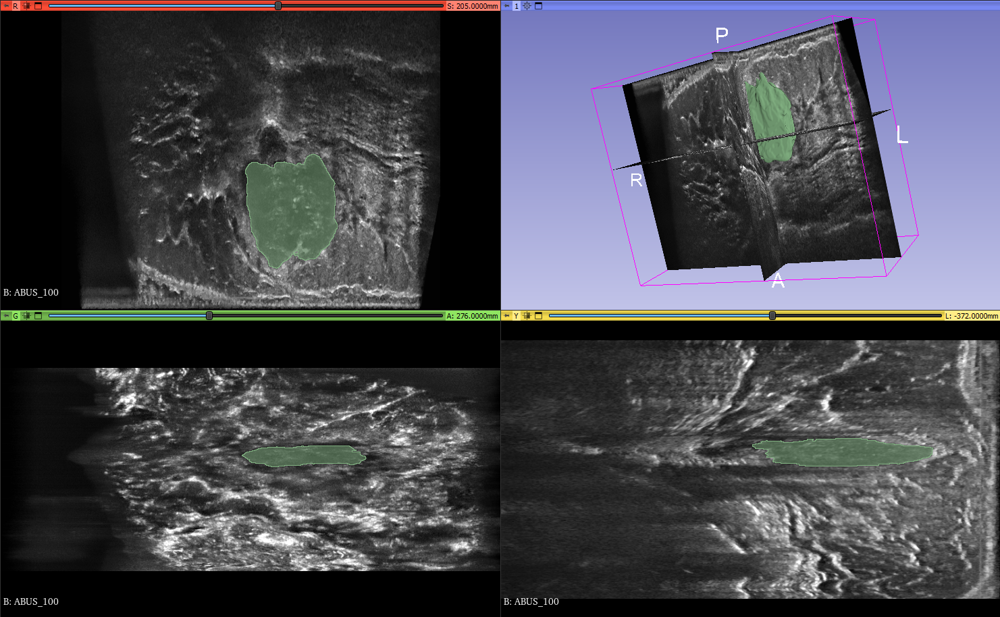

# Automated-3D-Breast-Ultrasound-Segmentation

## Project Description

This project focuses on tumour segmentation in Automated 3D Breast Ultrasound (ABUS) images, aiming to provide an efficient and accurate method for assisting in the diagnosis of breast cancer. The nnUNet framework was used in this project for its ability to automatically configure itself to work optimally with a given dataset and its flexibility in comparing segmentation using either 2D slices or 3D volumetric data.

## Setup and Usage Instructions

### Setup
1. Clone this repository.
2. Convert data to the correct formatting and load into /apis/nnUNet_raw/Dataset501_BreastTumour/ (nrrd_to_nifti.py is the current implementation but can be adapted to other file types).
3. Update /apis/nnUNet_raw/Dataset501_BreastTumour/dataset.json to align with the provided dataset.
4. Update the gpu files under apis/ to reflect your Compute Canada environment and your desired resource usage.

### Usage
1. Run gpu_preproc.sh with the dataset code "501" as a flag to create a dataset fingerprint
2. Then use gpu_train.sh specifying which one of the models to use, for example:
   - for i in {0..4}; do sbatch gpu_train.sh 501 3d_lowres $i; done  
3. You can use nnfind_bestconfig.sh to compare different model performances.
4. Perform testing using gpu_predict.sh to produce the image segmentations (this can accommodate ensemble learning using multiple models if desired).

## Acknowledgments

1. Isensee, F., Jaeger, P. F., Kohl, S. A., Petersen, J., & Maier-Hein, K. H. (2021). nnU-Net: a self-configuring 
method for deep learning-based biomedical image segmentation. Nature methods, 18(2), 203-211.
